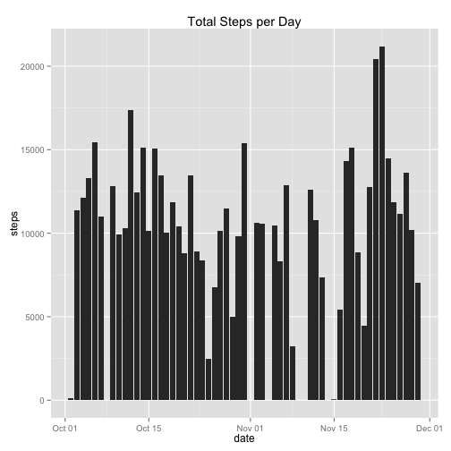
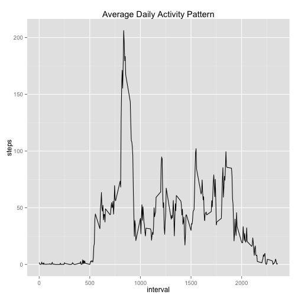
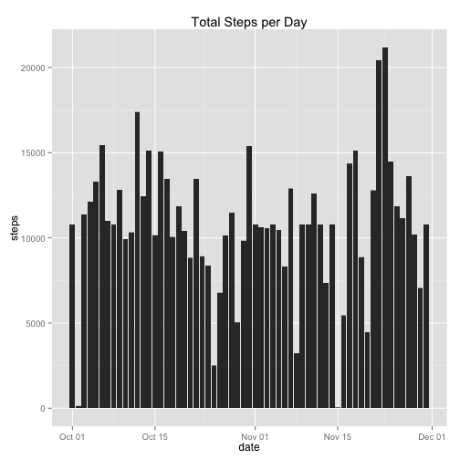
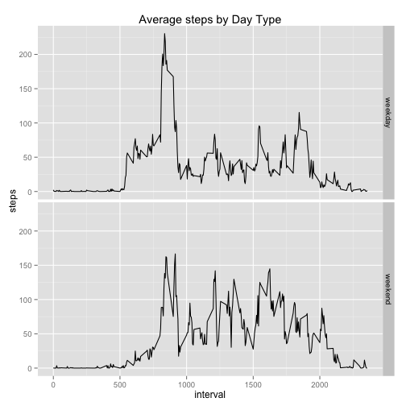

This research makes use of data from a personal activity monitoring device and aims to identify activity patterns. This device collects data at 5 minute intervals through out the day. The data consists of two months of data from an anonymous individual collected during the months of October and November, 2012 and include the number of steps taken in 5 minute intervals each day.

The data can be downloaded here:

* Dataset: [Activity monitoring data](https://d396qusza40orc.cloudfront.net/repdata%2Fdata%2Factivity.zip) [52K]

The variables included in this dataset are:

* **steps**: Number of steps taking in a 5-minute interval (missing
    values are coded as `NA`)
* **date**: The date on which the measurement was taken in YYYY-MM-DD
    format
* **interval**: Identifier for the 5-minute interval in which
    measurement was taken


## Loading and preprocessing the data

Throughout the assignment, we will be using ggplot2, so it's a good idea to load it here. The first step is unzipping the activity data file, loading it into R. Then we convert date fields into date format for our analysis. 


```r
library(ggplot2)
unzip("activity.zip")
dt <- read.csv("activity.csv")
dt$date<-as.Date(dt$date)
```

## What is mean total number of steps taken per day?

We use the aggregate function in R to find the total number of steps per day and then plot it as a bar graph.


```r
totalDailySteps <- aggregate(steps ~ date, dt, sum)
qplot(x = date, y = steps, data = totalDailySteps, geom = "bar", stat="identity", main = "Total Steps per Day")
```

 

Then we calculate and report the mean and median total number of steps taken per day


```r
mean(totalDailySteps$steps)
```

```
## [1] 10766.19
```

```r
median(totalDailySteps$steps)
```

```
## [1] 10765
```

## What is the average daily activity pattern?

We make a time series plot of the 5-minute intervals to identify daily activity patterns.


```r
averageSteps <- aggregate(steps ~ interval, dt, mean)
qplot(x = interval, y = steps, data = averageSteps, geom="line", main = "Average Daily Activity Pattern")
```

 

According to this plot, it seems that there is little or no activity between the intervals 0 and 500. The activity peaks around the interval 800, and fluctuates throughout the day before decreasing significantly around interval 2000.

To find the 5-minute interval on average across all the days in the dataset that contains the maximum number of steps, we use the max function.


```r
averageSteps[which.max(averageSteps$steps),]
```

```
##     interval    steps
## 104      835 206.1698
```

The peak activity is at interval 835 with 206 steps.

## Imputing missing values

There are a number of days/intervals where there are missing
values (coded as `NA`). The presence of missing days may introduce
bias into some calculations or summaries of the data. It's a good idea to replace 
missing values with meaningful values.

First we report the total number of missing values in the dataset. 


```r
sum(is.na(dt$steps))
```

```
## [1] 2304
```

To replace the missing values, our strategy is to use average values of 5-minute intervals.


```r
intervalAverages = round(tapply(X = dt$steps, INDEX = dt$interval, FUN = mean, na.rm = TRUE))
```

Then we create a new dataset that is equal to the original dataset and add the missing data filled in.


```r
newDt <- dt
newDt[is.na(newDt$steps),1] <- intervalAverages
```


And finally make a histogram of the total number of steps taken each day:


```r
newTotalDailySteps <- aggregate(steps ~ date, newDt, sum)
qplot(x = date, y = steps, data = newDt, geom = "histogram", stat="identity", main = "Total Steps per Day")
```

 

Finally, we calculate the **mean** and **median** total number of steps taken per day. 


```r
mean(newTotalDailySteps$steps)
```

```
## [1] 10765.64
```

```r
median(newTotalDailySteps$steps)
```

```
## [1] 10762
```

The mean has decreased from 10766.19 to 10765.64 and the median has decreased from 10765 to 10762. The impact of replacing missing values with interval averages has been negligibly small.

## Are there differences in activity patterns between weekdays and weekends?

To identify the difference in activity patterns between weekdays and weekends, we first create a new factor variable in the dataset with two levels -- "weekday" and "weekend" indicating whether a given date is a weekday or weekend day. The wday function in lubridate package helps us determine the name of a given date, which we can then check to see whether it's a weekday or a weekend day.


```r
library(lubridate)
newDt$daytype <- as.factor(ifelse(wday(newDt$date, label=TRUE) %in% c("Sat", "Sun"), "weekend", "weekday"))
```

Finally we make a panel plot containing a time series plot (i.e. `type = "l"`) of the 5-minute interval (x-axis) and the average number of steps taken, averaged across all weekday days or weekend days (y-axis). 


```r
averageStepsByDaytype <- aggregate(steps ~ daytype + interval, data = newDt, mean)
ggplot(averageStepsByDaytype) + aes(x=interval, y=steps) + facet_grid(daytype ~ .) + geom_line() + labs(title="Average steps by Day Type")
```

 

According to these plots, there are differences between weekdays and weekends. Weekdays seem to have higher peak in steps, whereas weekend activity is relatively balanced.
